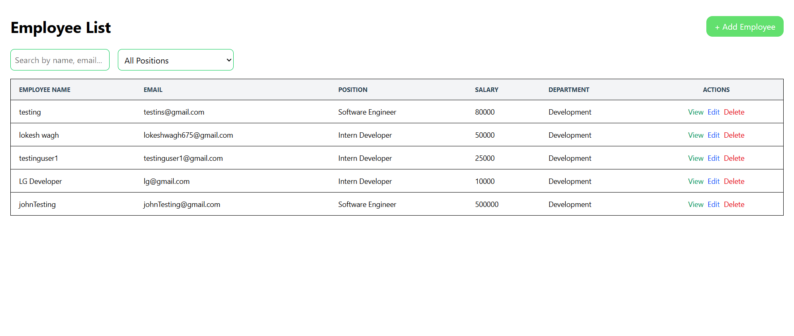
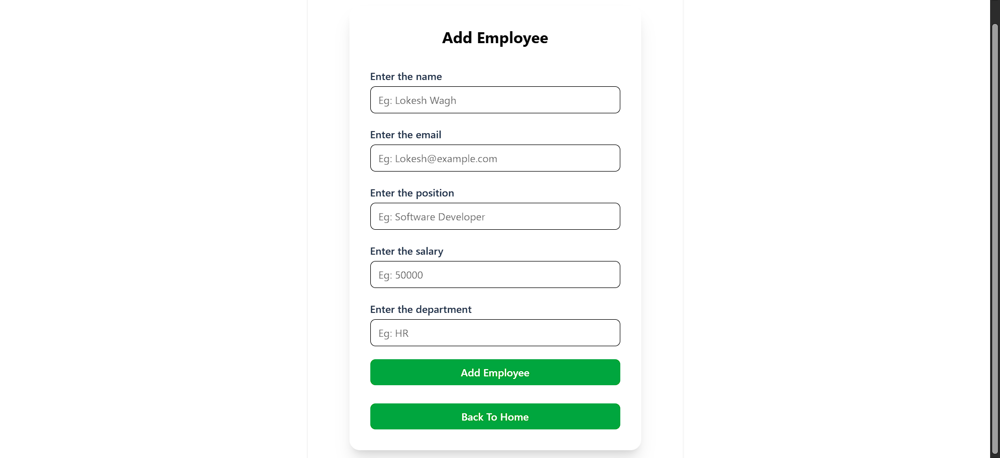

# Employee Data Management

## Project Overview


A robust and efficient full-stack application built on the MERN stack to provide a seamless solution for managing employee data. This project demonstrates a complete CRUD implementation with advanced features designed for performance, usability, and a modern user experience.

The architecture features a decoupled frontend and backend, communicating via a clean RESTful API. The system is not just a simple data manager; it's a showcase of modern web development practices, including state management, performance optimization, and a responsive UI.

## Home Page


## From 


## Form Validation


## Searching Feature 


##  Key Features

* ✅ **Full CRUD Operations:** Intuitive interface to Create, Read, Update, and Delete employee records.
* ✅ **Dynamic Live Search:** Instantly find employees by name or email. The search functionality is highly optimized to ensure a smooth user experience.
* ✅ **Advanced Filtering:** Effortlessly filter the employee list by their specific job position using a dynamic dropdown menu.
* ✅ **Performance Optimized:**
    * **Debouncing:** The search input is debounced to prevent excessive API calls, reducing server load and enhancing frontend performance.
    * **Component Memoization:** Utilizes React hooks like `useMemo` where necessary to prevent unnecessary re-renders and maintain a snappy UI.
* ✅ **Interactive Modals:** View detailed employee information in a clean, non-disruptive modal window.
* ✅ **Responsive Design:** A clean and modern UI that is fully responsive and works across various devices.

## 🚀 Architectural Highlights & Tech Stack

This project is built using the MERN stack, leveraging the power of each technology to create a cohesive and powerful application.

* **Frontend:**
    * **React:** For building a fast, component-based user interface.
    * **React Router:** For seamless client-side routing and navigation.
    * **Axios:** For making robust, promise-based HTTP requests to the backend API.
    * **Tailwind CSS:** For modern, utility-first styling.
    * **Formik and Yup:** Used for creating the form and Adding the validation in the form.

* **Backend:**
    * **Node.js & Express.js:** For building a lightweight, fast, and scalable RESTful API.
    * **Mongoose:** As an elegant Object Data Modeling (ODM) library for MongoDB, simplifying interactions with the database.
    * **CORS:** To handle cross-origin requests between the frontend and backend servers.

* **Database:**
    * **MongoDB Atlas:** A flexible, cloud-hosted NoSQL database that allows for storing and retrieving complex, schemaless data efficiently.

## Notes

- The search and filter are optimized using debouncing and React hooks.
- Form validations help maintain data quality.
- The app is responsive for mobile and desktop views.
  
## Installation

1. Clone the repository:
```
git clone git@github.com:LokeshWagh/EmployeeDataManagement.git . 
cd EmployeeDataManagement
```


3. Setup backend:
- Go to the Backend folder:
  ```
  cd Backend
  ```
- I connot used the .env file because you can easily access applicationa and don't be think about a credentials
- Install dependencies:
  ```
  npm install
  ```
- Start the backend server:
  ```
  npm start
  ```

3. Setup frontend:
- Go to the Frontend folder:
  ```
  cd Frontend
  ```
- Install dependencies:
  ```
  npm install
  ```
- Start the frontend server:
  ```
  npm run dev
  ```

4. Open your browser and navigate to `http://localhost:5173`

## How to Use

- Add, view, edit, and delete employees using the user interface.
- Use the search bar to find employees by name or email.
- Filter employees by position using the dropdown.
- Clear filters using the "Clear" button.


---

Feel free to explore and contribute!

